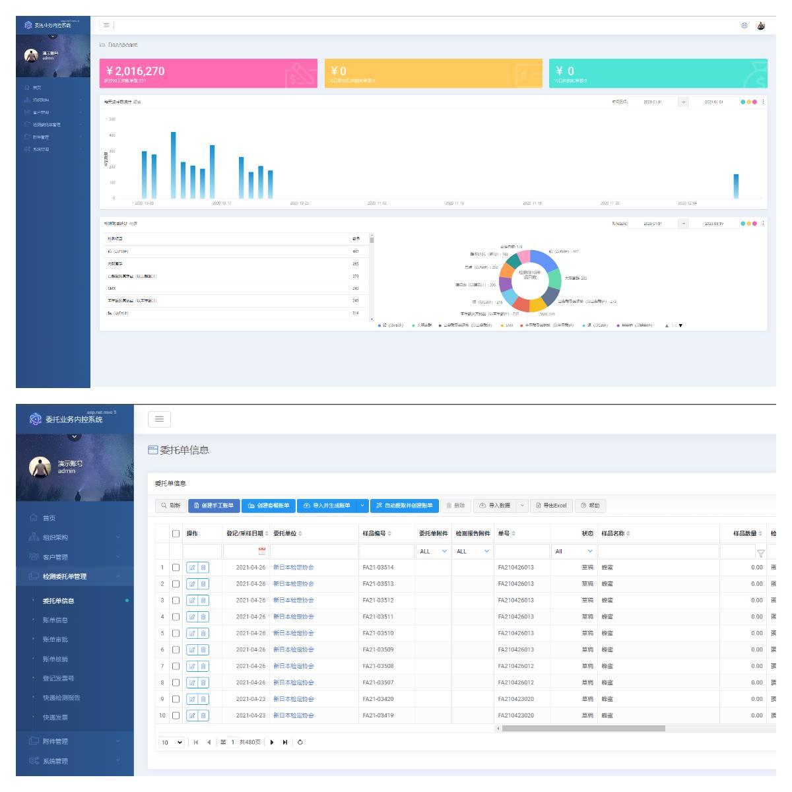
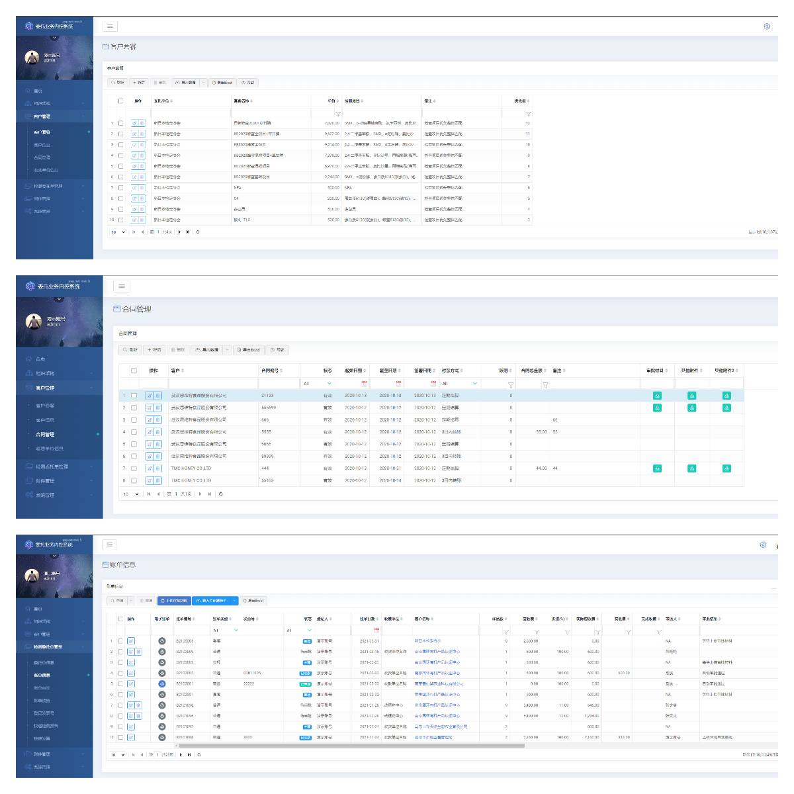

## xx海关检验委托业务管理系统

### Demo WebSite: https://inspectpro.i247365.net/
#### 登录用户和密码 
+ User Name:  Demo
+ Password:   123456

### 项目介绍
本项目是一款海关检验委托业务管理系统，主要包括委托单登记、导入导出、上传、审核、报价、账单审核、账单发送、开票、报告登记、电子报告自动发送、纸质报告邮寄登记和收款情况管理等功能，旨在提高业务管理效率和质量。

### 运行环境
- .net franework 4.8
- windows server 2012以上
- MS Sql Server 2012以上

### 业务需求
1. 委托单登记功能
-  接样人员在Lims里录入委托单信息，必须录入联系人手机号。委托单什么时候生效需明确。
2. 委托单导出导入
-  接样人员可将Lims中的委托单信息导出，导入业务管理系统。
- 系统会根据“委托单位”自动确定是长期客户还是短期客户，并关联账期和折扣，自动计算交款截止日期。
- 交款截止日期 = 送样日期 + 7个工作日。如果委托单位有合同，根据合同约定的账期确定，交款截止日=结款周期结束后+15个工作日。
- 委托单位信息在“客户管理”里维护。
3. 委托单上传功能
- 接样人员可将纸质委托单扫描生成pdf文件，选择对应的委托单上传业务管理系统。
4. 委托单审核功能
- 审核人员根据纸质委托单核对业务管理系统数据进行核对。如何在Lims直接核对和修改需明确。
5. 委托单报价功能
- 报价人员以委托企业为单位，选择一条或多条样品数据，选择折扣生成账单。
6. 账单网上审核功能
- 根据规则，账单通过网上进行审核。
- 账单审核规则：马艳艳八折以上（含八折），刘星、张文贵七折以上（含七折），曹锡忠、刘星7折以下（不含七折），双人同时审批。
7. 账单自动发送功能
- 客服人员将通过审核的账单发送给客户确认。
- 系统自动通过短信给客户发送账单链接，账单上有业务章水印，客户可以自己下载账单。
- 如对账单没有异议，客户可对账单进行确认并支付相应费用。
- 客服人员可手工补发或重发。
8. 开票功能
- 财务人员根据银行进账单开发票，并对账单进行核销，填写发票

### 账单的几种生产方式

1. 国环的委托单
- 国环的委托单样品编号以 flxx-e开头
- 国环是按检测项目单独收费
- 根据选中委托单的检查项目按下表备注的说明进行计算

|适用单位|套餐名称|单价|检查项目|备注|
|:----|:----|:----|:----|:----|
|国环|农残套餐|600|倍硫磷、苯胺灵、苯醚甲环唑、吡虫啉、吡唑醚菌酯(唑菌胺酯)、丙溴磷(溴丙磷)、虫螨腈(溴虫腈)、虫酰肼、哒螨灵、敌百虫、敌敌畏、啶虫脒、啶酰菌胺、毒死蜱、多菌灵、多效唑、二甲戊灵|检查项目优先整体匹配|
|国环|农残套餐|600|倍硫磷、苯胺灵、苯醚甲环唑、吡虫啉、吡唑醚菌酯(唑菌胺酯)、丙溴磷(溴丙磷)、虫螨腈(溴虫腈)、虫酰肼、哒螨灵、敌百虫、敌敌畏、啶虫脒、啶酰菌胺、毒死蜱、多菌灵、多效唑、二甲戊灵(二甲戊乐灵)、氟胺氰菊酯、氟虫腈(锐劲特)、氟氯氰菊酯、腐霉利、禾草丹、己唑醇、甲氨基阿维菌素苯甲酸盐、甲拌磷、甲草胺、甲基毒死蜱、甲基嘧啶磷、甲萘威、甲氰菊酯、甲霜灵、腈苯唑、腈菌唑、克百威(呋喃丹)、联苯菊酯、氯氟氰菊酯、氯氰菊酯、马拉硫磷、醚菊酯、醚菌酯、嘧霉胺、氰戊菊酯、噻虫胺、噻虫啉、噻虫嗪、噻菌灵、噻嗪酮、三氯杀螨|检查项目优先整体匹配|
|国环|灌溉水|750|pH值、氟化物、镉、铬(六价)、氯化物、铅、总汞|检查项目优先整体匹配|
|国环|灌溉水|750|pH值、氟化物、镉、铬(六价)、氯化物、铅、阴离子表面活性剂|检查项目优先整体匹配|
|国环|渔业水|900|pH值、氟化物、镉、铬(六价)、氯化物、铅、阴离子表面活性剂|检查项目优先整体匹配|
|国环|生活用水|750|镉(以Cd计)、黄曲霉毒素B1、铅(以Pb计)、亚硝酸盐(以亚硝酸钠计)|检查项目优先整体匹配|
|国环|生活用水|750|镉、耗氧量(以O2计)、铅、三氯甲烷、砷、四氯化碳、溴酸盐|检查项目优先整体匹配|
|国环|饲料|1150|T-2毒素、亚硝酸盐、玉米赤霉烯酮|检查项目优先整体匹配|
|国环|植物饮料|2000|苯甲酸及其钠盐(以苯甲酸计)、赤藓红、亮蓝、柠檬黄、日落黄、山梨酸及其钾盐(以山梨酸计)、糖精钠(以糖精计)、苋菜红、新红、胭脂红|检查项目优先整体匹配|
|国环|食用油|1000|苯并(a)芘、过氧化值、铅(以Pb计)、特丁基对苯二酚(TBHQ)、总砷(以As计)|检查项目优先整体匹配|
|国环|食用油|1000|苯并(α)芘、过氧化值、铅(以Pb计)、特丁基对苯二酚(TBHQ)、总砷(以As计)|检查项目优先整体匹配|
|国环|葡萄酒、果酒|1050|苯甲酸及其钠盐(以苯甲酸计)、二氧化硫、山梨酸及其钾盐(以山梨酸计)、甜蜜素(以环己基氨基磺酸计)|检查项目优先整体匹配|
|国环|酱油、醋、黄酒|800|苯甲酸及其钠盐(以苯甲酸计)、山梨酸及其钾盐(以山梨酸计)、糖精钠(以糖精计)、脱氢乙酸及其钠盐(以脱氢乙酸计)|检查项目优先整体匹配|
|国环|鱼|2500|恩诺沙星、恩诺沙星(以恩诺沙星与环丙沙星之和计)、呋喃西林代谢物、环丙沙星、孔雀石绿、孔雀石绿(孔雀石绿和隐色孔雀石绿残留量之和)、氯霉素、隐性孔雀石绿|检查项目优先整体匹配|
|国环|奶粉|1050|铬(以Cr计)、黄曲霉毒素M1、三聚氰胺|检查项目优先整体匹配|
|国环|黄曲霉毒素M1|800|黄曲霉毒素M1|没有匹配上的检查项目逐个匹配|
|国环|苯甲酸及其钠盐(以苯甲酸计)|200|苯甲酸及其钠盐(以苯甲酸计)|没有匹配上的检查项目逐个匹配|
|国环|山梨酸及其钾盐(以山梨酸计)|200|山梨酸及其钾盐(以山梨酸计)|没有匹配上的检查项目逐个匹配|
|国环|蛋白质|150|蛋白质|没有匹配上的检查项目逐个匹配|
|国环|铅(以Pb计)|150|铅(以Pb计)|没有匹配上的检查项目逐个匹配|
|国环|铜|150|铜|没有匹配上的检查项目逐个匹配|
|国环|总砷(以As计)|150|总砷(以As计)|没有匹配上的检查项目逐个匹配|
|国环|镉(以Cd计)|150|镉(以Cd计)|没有匹配上的检查项目逐个匹配|
|国环|亚硝酸盐(以亚硝酸钠计)|150|亚硝酸盐(以亚硝酸钠计)|没有匹配上的检查项目逐个匹配|
|国环|农药单项|140|其余项目|剩下的检查项目就是 农药单项|

- 生成账单的时候，可以让用户上传pdf文件。
- 国环账单不用领导审批，系统自动审批通过，进入核销环节。
1. 	紫金的委托单
紫金的委托单是“特殊要求描述”字段里含有“紫金”。
生成账单的时候，让用户输入折后应收总金额和实收总金额，同时可以上传pdf文件。
    紫金的账单不用领导审批，系统自动审批通过，进入核销环节。
2. 	日本样的委托单
日本样的委托单计算方法和国环的类似，也是企业—套餐的形式来计算费用。 具体企业-套餐标准另行提供。
注意：委托单自定义编号字段如果含有“Quality Control Sample” ,此样品不收费。
3. 	市场局的委托单
市场局的委托单以ff开头。
通过导入excel文件（excel文件里主要字段是样品编号）来生成账单，生成账单的时候，让用户输入缴款单位、实收金额，并上传pdf文件。
市场局的账单不用领导审批，系统自动审批通过，进入核销环节。
4. 	普通委托单
生成账单的时候，可以统一输入折扣，也可以让用户修改单个样品的折扣。
